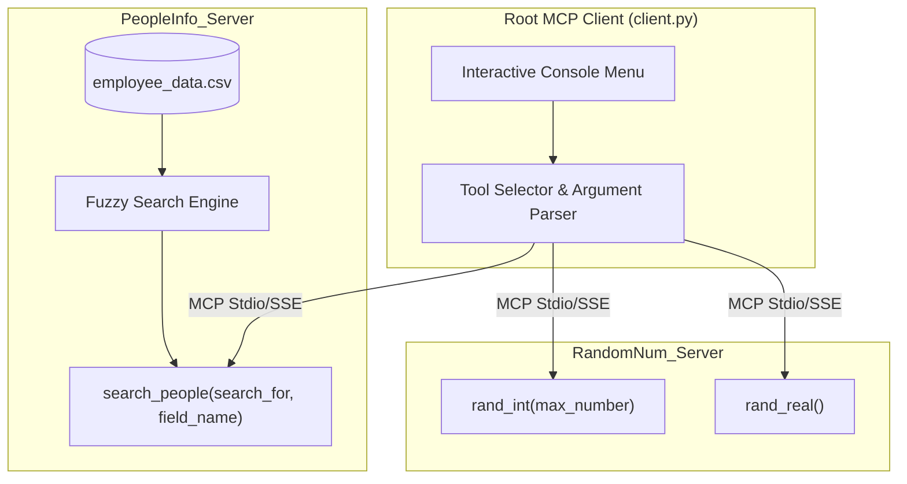

# MCP Docker System Implementation Plan

Implement a complete Model Context Protocol (MCP) ecosystem consisting of two independent MCP server containers (`PeopleInfo_Server` and `RandomNum_Server`), a console-based MCP client application at the root directory, deployment configurations (Dockerfiles and docker-compose), and comprehensive documentation in accordance with [SPECIFICATIONS.md](file:///home/pi-net/Documents/agent_eng_labs/ai-agent-experiments/class_6_MCP/2_MCP_docker/SPECIFICATIONS.md).

## User Review Required

> [!NOTE]
> The current host environment does not have the `docker` CLI installed (`command not found`). To provide seamless execution in both environments:
> 1. Complete Docker deployment files (`Dockerfile` for each server, `docker-compose.yml`, build scripts) will be provided for container deployment.
> 2. The root MCP client will support dual execution modes: **Docker container mode** (`docker run -i ...` or SSE) and **Direct Python mode** (automatic fallback or `--local` flag), allowing immediate testing and validation on systems without Docker.

## Architecture Overview



---

## Proposed Changes

### PeopleInfo_Server Component

#### [NEW] [employee_data.csv](file:///home/pi-net/Documents/agent_eng_labs/ai-agent-experiments/class_6_MCP/2_MCP_docker/PeopleInfo_Server/employee_data.csv)
- Create a CSV containing at least 25 diverse records with headers: `name`, `city`, `country`, `position`.
- Include realistic variations in positions (e.g. Software Engineer, Data Scientist, Product Manager, DevOps Lead) and global locations.

#### [NEW] [server.py](file:///home/pi-net/Documents/agent_eng_labs/ai-agent-experiments/class_6_MCP/2_MCP_docker/PeopleInfo_Server/server.py)
- Implement `PeopleInfo_Server` using `FastMCP`.
- Define tool `search_people(search_for: str, field_name: str) -> list[dict]`:
  - Validates `field_name` against CSV columns (`name`, `city`, `country`, `position`).
  - Performs fuzzy text matching using a combination of case-insensitive substring matching and `difflib.SequenceMatcher` / `rapidfuzz` scoring.
  - Returns matching records containing `name`, `city`, `country`, `position`.
- Standard stdio entrypoint for MCP server communication.

#### [NEW] [requirements.txt](file:///home/pi-net/Documents/agent_eng_labs/ai-agent-experiments/class_6_MCP/2_MCP_docker/PeopleInfo_Server/requirements.txt)
- Package dependencies: `fastmcp>=4.0.0`, `mcp>=2.1.0`.

#### [NEW] [Dockerfile](file:///home/pi-net/Documents/agent_eng_labs/ai-agent-experiments/class_6_MCP/2_MCP_docker/PeopleInfo_Server/Dockerfile)
- Python 3.12-slim base image.
- Installs `requirements.txt`, copies application files and `employee_data.csv`.
- Sets `PYTHONUNBUFFERED=1` and runs `python server.py`.

---

### RandomNum_Server Component

#### [NEW] [server.py](file:///home/pi-net/Documents/agent_eng_labs/ai-agent-experiments/class_6_MCP/2_MCP_docker/RandomNum_Server/server.py)
- Implement `RandomNum_Server` using `FastMCP`.
- Tool 1: `rand_int(max_number: int) -> int` returning a random integer in `[1, max_number]`.
- Tool 2: `rand_real() -> float` returning a random real float in `[0.0, 1.0]`.

#### [NEW] [requirements.txt](file:///home/pi-net/Documents/agent_eng_labs/ai-agent-experiments/class_6_MCP/2_MCP_docker/RandomNum_Server/requirements.txt)
- Package dependencies: `fastmcp>=4.0.0`, `mcp>=2.1.0`.

#### [NEW] [Dockerfile](file:///home/pi-net/Documents/agent_eng_labs/ai-agent-experiments/class_6_MCP/2_MCP_docker/RandomNum_Server/Dockerfile)
- Python 3.12-slim base image.
- Installs `requirements.txt`, copies server code.
- Sets `PYTHONUNBUFFERED=1` and runs `python server.py`.

---

### Client Component

#### [NEW] [client.py](file:///home/pi-net/Documents/agent_eng_labs/ai-agent-experiments/class_6_MCP/2_MCP_docker/client.py)
- Interactive MCP client implementing standard MCP client lifecycle:
  1. Establishes connections to both `PeopleInfo_Server` and `RandomNum_Server`.
  2. Queries `list_tools()` dynamically across servers to discover all tools and parameter schemas.
  3. Formats console menu:
     ```
     Available MCP Tools:
     1. search_people - PeopleInfo_Server
     2. rand_int - RandomNum_Server
     3. rand_real - RandomNum_Server
     4. Quit
     ```
  4. Selection handling:
     - On number selection, displays required parameter names and types.
     - Accepts comma-separated values from the user.
     - Parses and casts arguments according to schema (e.g. integers vs strings).
     - Dispatches call via MCP protocol.
     - Prints the raw server response directly to console.
     - Loops until user selects Quit.
  5. Configurable transport: supports running either via Docker stdio (`docker run -i --rm <image>`) or Python stdio (`python <path>/server.py`).

#### [NEW] [requirements.txt](file:///home/pi-net/Documents/agent_eng_labs/ai-agent-experiments/class_6_MCP/2_MCP_docker/requirements.txt)
- Root dependencies: `fastmcp>=4.0.0`, `mcp>=2.1.0`.

---

### Deployment and Documentation

#### [NEW] [docker-compose.yml](file:///home/pi-net/Documents/agent_eng_labs/ai-agent-experiments/class_6_MCP/2_MCP_docker/docker-compose.yml)
- Docker compose service definitions to build and manage both containers (`peopleinfo_server` and `randomnum_server`).

#### [NEW] [README.md](file:///home/pi-net/Documents/agent_eng_labs/ai-agent-experiments/class_6_MCP/2_MCP_docker/README.md)
- Complete overview of the architecture and tools.
- Step-by-step setup guide for both Docker and local environments.
- Build instructions (`docker build`, `docker compose`).
- Running the interactive client and example input/output sessions.

---

## Verification Plan

### Automated Tests
1. **PeopleInfo_Server tool test**:
   - Run server test script querying `search_people`:
     - Test exact match: `search_for="Engineer", field_name="position"`
     - Test fuzzy match / typo: `search_for="Enginer", field_name="position"`
     - Test country / name search.
     - Check returned structure contains `name`, `city`, `country`, `position`.
2. **RandomNum_Server tool test**:
   - Run server test script calling:
     - `rand_int(max_number=10)`: verify integer in range `1..10`.
     - `rand_real()`: verify float in range `0.0..1.0`.
3. **Client integration test**:
   - Automated subprocess test running `client.py` with simulated user inputs:
     - Input selecting `rand_real` -> verify output contains float.
     - Input selecting `rand_int` with `10` -> verify output contains integer.
     - Input selecting `search_people` with `Alice, name` -> verify matching people records.
     - Input selecting `Quit` -> verify graceful termination.

### Manual Verification
- Run `python client.py` interactively to verify menu appearance, comma-separated parameter entry, error handling for invalid options, and raw response output formatting.
